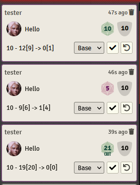
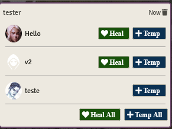

# Does it Hit?! (A5E)

 

"Does it Hit?!" is part of a suite of modules that aim to provide basic automation for the A5E system. This module automates hit checking, damage application, heal application.

### Notes

- In order for the hit-check and saving throw automation to work, the targets must be targeted before an attack is rolled.
- The automation cards are only visible to the Narrator.

This module will be feature complete once the following functionality has been implemented, at which point it will only be in maintenance mode.

- Mass NPC saving throws

